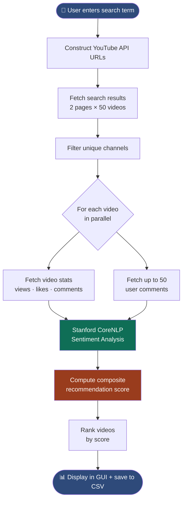
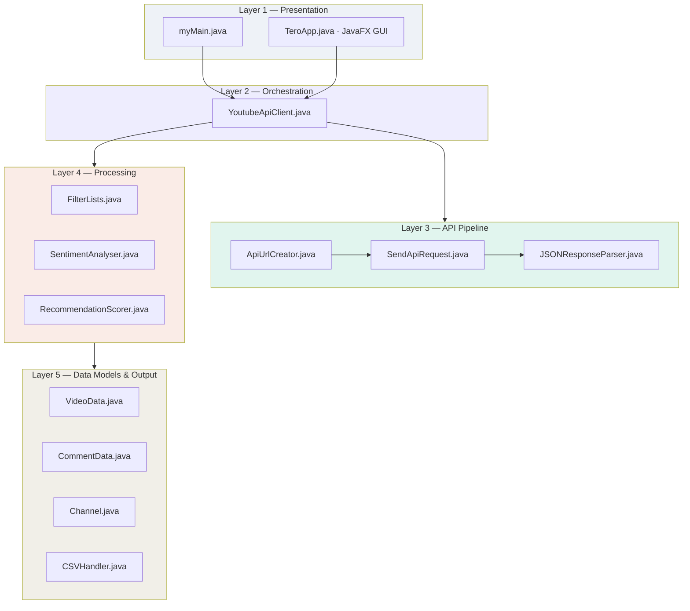
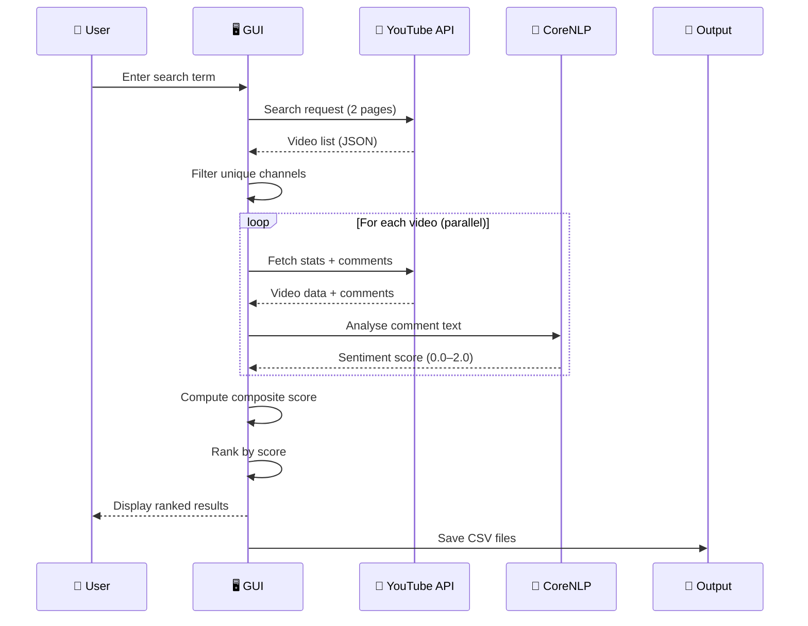

<div align="center">

# 🔦 Lumis
### Intelligent YouTube Video Recommendation System

*Surfacing the best content through sentiment-aware ranking*


<br/>

> **Lumis** fetches YouTube videos, reads what audiences are saying in comments using NLP sentiment analysis, and ranks videos by combining engagement metrics with sentiment scores — going beyond simple popularity metrics.

</div>

---

## 📌 Table of Contents

- [Overview](#-overview)
- [Features](#-features)
- [How It Works](#-how-it-works)
- [System Architecture](#-system-architecture)
- [Data Flow](#-data-flow)
- [Recommendation Formula](#-recommendation-formula)
- [Tech Stack](#-tech-stack)
- [Project Structure](#-project-structure)
- [Setup & Installation](#-setup--installation)
- [Screenshots](#-screenshots)


---

## 🧠 Overview

Most YouTube recommendation systems depend on **watch history** and **view count** alone. Lumis introduces a third dimension — **what the audience is actually saying**.

By running Stanford CoreNLP on user comments, Lumis detects whether audience sentiment is positive, neutral, or negative, and incorporates that signal into a weighted composite score. A video with 10 million views but negative comments will rank lower than a video with fewer views but genuinely positive audience reception.

---

## ✨ Features

| Feature | Description |
|---|---|
| 🎯 **Smart Recommendations** | Combines views, likes, comments and sentiment into one composite score |
| 💬 **NLP Sentiment Analysis** | Stanford CoreNLP analyses audience comments — positive / neutral / negative |
| 🔍 **YouTube API Integration** | Official YouTube Data API v3 — fetches metadata, stats, and comments |
| 🎨 **JavaFX GUI** | Clean search interface with colour-coded ranked results table |
| 🔗 **Clickable Links** | Every result has a direct ▶ Open button to the YouTube video |
| 📊 **CSV Export** | Saves full ranked results and comment data to local files |
| ⚡ **Parallel Processing** | Multi-threaded pipeline — 4 videos processed simultaneously |
| 🔄 **Channel Diversity** | Unique channel filter ensures results from different creators |

---

## ⚙️ How It Works



---

## 🏗️ System Architecture



---

## 🌊 Data Flow



---

## 📐 Recommendation Formula

Each video receives a composite score from **0.0 to 1.0**:

```
Score = (0.35 × normViews) + (0.25 × normLikes) + (0.15 × normComments) + (0.25 × normSentiment)
```

All metrics are normalised to 0–1 before combining so no single factor dominates.

| Signal | Weight | Why |
|---|---|---|
| 👁️ View Count | **35%** | Primary engagement signal |
| 👍 Like Count | **25%** | Direct positive feedback |
| 💬 Comment Count | **15%** | Audience engagement depth |
| 🧠 Sentiment Score | **25%** | Qualitative audience reception |

**Sentiment scoring:**
```
0.0 ──────── 1.0 ──────── 2.0
Negative    Neutral    Positive
```

---

## 🛠️ Tech Stack

<div align="center">

| Technology | Version | Purpose |
|---|---|---|
| ☕ Java | 21 | Core language |
| 🎨 JavaFX | 21 | Desktop GUI |
| 🔴 YouTube Data API v3 | — | Video data source |
| 🧠 Stanford CoreNLP | 4.5.4 | NLP sentiment analysis |
| 📦 Apache Maven | 3.6+ | Build & dependency management |
| 📄 OpenCSV | 5.8 | CSV file output |
| 📊 Apache POI | 4.1.2 | Excel file support |

</div>

---

## 📁 Project Structure

```
Lumis/
├── src/
│   └── main/java/myproject/icarus/
│       ├── myMain.java               ← Entry point
│       ├── TeroApp.java              ← JavaFX GUI
│       ├── YoutubeApiClient.java     ← Pipeline orchestrator
│       ├── ApiUrlCreator.java        ← YouTube API URL builder
│       ├── SendApiRequest.java       ← HTTP GET handler
│       ├── JSONResponseParser.java   ← JSON → Java objects
│       ├── SentimentAnalyser.java    ← Stanford CoreNLP pipeline
│       ├── RecommendationScorer.java ← Composite scoring + ranking
│       ├── FilterLists.java          ← Unique channel deduplication
│       ├── VideoData.java            ← Video data model
│       ├── CommentData.java          ← Comment data model
│       └── Channel.java             ← Channel data model
├── pom.xml                           ← Maven dependencies
└── README.md
```

---

## 🚀 Setup & Installation

### Prerequisites

- JDK 21 or above
- Apache Maven 3.6+
- YouTube Data API v3 key ([Get one here](https://console.cloud.google.com/))
- IntelliJ IDEA (recommended)

### Steps

**1. Clone the repository**
```bash
git clone https://github.com/Yash-Pandey19/Lumis.git
cd Lumis
```

**2. Add your YouTube API key**

Open `src/main/java/myproject/icarus/YoutubeApiClient.java` and add your key:
```java
static final String API_KEY = "YOUR_API_KEY_HERE";
```

> ⚠️ Never commit your API key. Add it after cloning.

**3. Build with Maven**
```bash
mvn clean install
```

**4. Run**

In IntelliJ IDEA, open `myMain.java` and run with VM option:
```
-Xmx6g
```

### Output

Results are saved automatically to:
```
project-root/
└── {search-term}/
    ├── results_summary.csv   ← ranked videos with all scores
    └── {videoId}.csv         ← comments per video
```

---


